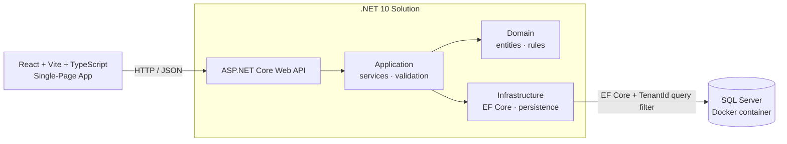

# Invoice & Payment Reconciliation Platform

-512BD4)

A multi-tenant platform that manages invoices, ingests payments from multiple channels, and **automatically matches payments against invoices** — including the messy real-world cases: partial payments, overpayments, and a single payment settling several invoices at once.

> 🚧 **Status: early development.** This project is being built deliberately, one vertical slice at a time (database → domain → API → UI → tests). The roadmap below tracks what exists versus what's planned. Nothing here is a throwaway demo — the goal is production-shaped architecture, testing, and deployment.

---

## The problem

Reconciliation is where accounts-receivable teams lose hours. Money arrives through different channels — bank transfers, card payments, manual entries — often with little more than a free-text note like *"payment for inv 1042 & 1043, less $50 credit."* Someone then has to figure out which invoices each payment covers, handle the partial and over-payments, and chase what doesn't add up.

This platform models that domain properly: a matching engine that proposes how incoming payments settle outstanding invoices, and a review workflow for the exceptions a machine shouldn't decide alone.

## What makes it more than CRUD

- **A real matching engine** — many-to-many settlement (one payment ↔ many invoices, and vice versa), partial payments, and overpayments, expressed as set-based logic over the ledger.
- **Multi-tenancy from day one** — a shared database with tenant isolation enforced at the data layer, not bolted on later.
- **Human-in-the-loop reconciliation** — the system auto-proposes confident matches and routes the rest to a review/exceptions queue.

---

## Architecture

A layered (clean-architecture) solution with clear dependency boundaries, kept as separate projects:

| Layer | Responsibility |
|---|---|
| **Domain** | Entities, value objects, and business rules. No framework dependencies. |
| **Application** | Use-case services, validation, and orchestration. Depends only on Domain. |
| **Infrastructure** | EF Core persistence, external integrations. Implements Application interfaces. |
| **API** | ASP.NET Core Web API — the HTTP surface, wiring, and composition root. |

**Multi-tenancy:** shared database with a `TenantId` on tenant-owned tables, enforced automatically via an **EF Core global query filter** so no query can accidentally leak across tenants.

*(Runtime request flow. Dependency direction follows clean-architecture rules — Domain depends on nothing; Infrastructure and API depend inward.)*

---

## Tech stack

**Backend**
- ASP.NET Core Web API on **.NET 10 (LTS)**, C#
- **Entity Framework Core** — code-first with migrations
- **SQL Server**

**Frontend**
- **React** + **Vite** + **TypeScript**
- **Tailwind CSS**, **React Router**

**Testing**
- **xUnit** for unit tests
- **WebApplicationFactory** for API integration tests

**Local dev & tooling**
- **Docker Compose** for SQL Server
- VS Code, Git / GitHub
- `.http` files for API testing

**Planned (see roadmap)**
- Stripe (card payment channel, with webhooks & idempotency)
- AI copilot via Microsoft.Extensions.AI — remittance parsing with RAG + vector search
- GitHub Actions CI/CD, Azure deployment, Serilog, health checks, rate limiting

---

## Getting started

**Prerequisites**
- [.NET 10 SDK](https://dotnet.microsoft.com/download/dotnet/10.0)
- [Node.js](https://nodejs.org/) (LTS)
- [Docker Desktop](https://www.docker.com/products/docker-desktop/)
- The EF Core CLI: `dotnet tool install --global dotnet-ef`

**Run it locally**

> Setup and run instructions are added here as the first vertical slices land. The intended flow: start SQL Server via `docker compose up`, apply EF Core migrations, run the API, then start the React dev server.

---

## Roadmap

Built as vertical slices — each one runs end to end (database → domain → API → UI → tests) before the next begins.

**Foundation**
- [ ] Solution structure (Domain / Application / Infrastructure / API)
- [ ] Multi-tenancy scaffolding (`TenantId` + global query filter)
- [ ] First entity end-to-end: **Invoices**
- [ ] Docker Compose for SQL Server + EF Core migrations

**Core reconciliation**
- [ ] Payments — manual entry
- [ ] Payment ingestion — bank statement (CSV) import
- [ ] Matching engine — auto-propose (partial / over / many-to-many)
- [ ] Review & exceptions queue (human-in-the-loop)
- [ ] Adjustments — credit notes, short-payments, write-offs
- [ ] Authentication & authorization

**Future / parked**
- [ ] Stripe card payment channel (webhooks, idempotency)
- [ ] AI remittance copilot (Microsoft.Extensions.AI, RAG, vector search)
- [ ] CI/CD (GitHub Actions) & Azure deployment
- [ ] Observability — Serilog, health checks, rate limiting

*Roadmap and slice order are still being finalized and will evolve as the project progresses.*

---

## How this project is built

This repo doubles as a record of engineering judgement, not just working code:

- **Design before code.** Each slice starts with 2–3 viable approaches and their trade-offs; the chosen approach and its alternatives are recorded.
- **One vertical slice at a time.** No half-finished features spanning the codebase.
- **Tested as it's built.** Unit tests for domain logic, integration tests against a real API host.

---

## License

Released under the MIT License — see [`LICENSE`](./LICENSE).
